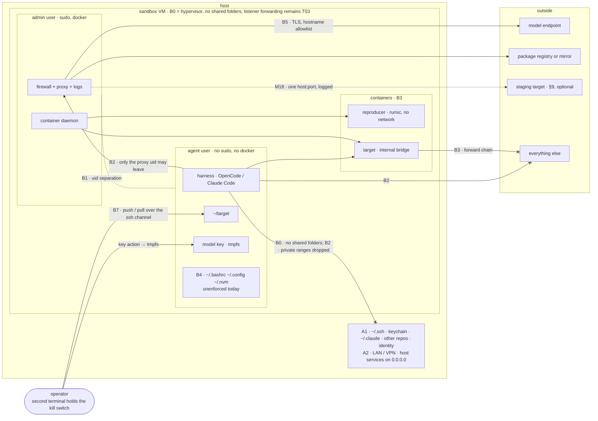

# Sandbox Threat Model

**Status:** draft v0.3, 2026-09-09; documentation consolidation, **scripts remain
v0.2**. v0.3 adds a portable acceptance contract (§12), corrects claims against
the scripts, and links the [implementation comparison](sandbox-comparison.md).
No new VM validation was performed. v0.1 (same day) was written *after* v0.2 of
the [reference sandbox](reference-sandbox-colima.md), on purpose: both v0.1 → v0.2
fixes of the sandbox (the agent inheriting passwordless sudo; container traffic
bypassing the egress filter) were found by review, not by design. This document
is the design step that was skipped. v0.2 of the model reflects a walk-through
with the maintainer that fixed the design case (§1), reordered the threat
sources (§3), added the unit under test's dependencies and the target's own
side effects as sources, and admitted staging access as a sanctioned relaxation
(§9).

The catalogue is written against **boundaries**, not mechanisms: the "v0.2"
column says how the Colima/Lima implementation enforces a row today. Replacing
the base — [Docker `sbx` and open alternatives](sandbox-comparison.md) are
evaluated against §12 — changes that column, not the rows. Threat IDs (`T01` …) and
measure IDs (`M1` …) are meant to be cited from the guide, the scripts, and the
[hardening checklist](../docs/src/content/docs/hardening/hardening-checklist.md).

Facts about tools carry the repository's tags: `verified-at-source`
(documentation read on the date given), `checked` (done on a v0.2 VM),
`reported-but-unverified`, `to-verify`.

## 1. Design case and scope

**Defensive operations on your own code.** One AppSec engineer runs an AI
coding agent against a repository the organisation owns, on a laptop,
interactively, with a second terminal open for the kill switch. The agent, the
operator, and the repository all mean well. This is *not* a model for analysing
untrusted or hostile code; anyone with that need should not read the rows
below as covering it.

**The design stance.** The agent has a shell, the repository, a model API key,
and egress to the model endpoint. That endpoint is a leak channel by
construction: whatever the agent can read, it can put into a prompt. The
sandbox therefore cannot promise that data stays private. Its objective is
that **only deliberately imported project data and explicitly granted
capabilities are within reach**, alongside the necessary runtime and toolchain.
That is an acceptance target, not a guarantee the current scripts fully meet.
A credential proxy can keep the raw key outside the workload, but the workload
can still exercise its authority through that proxy (T25/T26). No ambient host
identity, signing service, shared skill store, or host-executed tool is implied
by permission to analyse a repository.

**Phases of a run** — the allowlist and the threats differ per phase:

| Phase | Who | Needs |
|---|---|---|
| provision | admin, host wrapper | open internet: apt, gVisor, nvm, Node, harness, image pulls |
| import | operator, from the host | the repository travels in over the SSH channel — **no guest egress** |
| run | agent user | the model endpoint; a package registry (the agent installs dependencies as part of its job); optionally one named staging target (§9) |
| export | operator, from the host | findings and evidence travel out over the SSH channel |
| teardown | operator, from the host | VM stopped or destroyed; key revoked; staging reset if used |

**Three kinds of agent process** appear in the tool shortlist and each loads a
different boundary:

1. **Harness agent** (OpenCode, Claude Code) as the `agent` user — the default.
2. **Containerised agent** (Strix, PentAGI) — needs the model endpoint from
   inside a container; adds a running target.
3. **Reproducer / generated code** — written by the agent from whatever it
   read; runs in `runsc` without network.

**Out of scope** (owned elsewhere or accepted): the chosen model provider
seeing the repository (tier decision) and whether its retention policy is what
you think it is (§10); a hostile operator; a compromised host; the CI variant
([`ci-runner-design.md`](ci-runner-design.md) §2 reuses this
catalogue); availability.

## 2. Assets

| ID | Asset | Loss looks like |
|---|---|---|
| A1 | **Host filesystem, credentials, and identity** — `~/.ssh`, keychain, browser profiles, `~/.claude`, `~/.config/opencode`, every other repository, the user's name and account | read by the agent, hence in a prompt |
| A2 | **Host network position** — LAN, VPN into the organisation, SSO cookies, services bound to `0.0.0.0` on the host | the sandbox becomes a foothold or a scanner with the operator's ambient authority |
| A3 | **Model API key** | spent by someone else; misuse attributed to the organisation |
| A4 | **Code-host and registry credentials** | write access to the organisation's repositories or packages |
| A5 | **Repository under test** and, more sensitive, **unfixed-vulnerability details** | leave to anywhere but the chosen endpoint and the operator |
| A6 | **Integrity of findings** | a human or a downstream tool acts on fabricated or steered output |
| A7 | **Integrity of the sandbox** — nftables, allowlist, proxy, harness config, toolchain, rc files | containment switched off, or quietly relaxed for the *next* run |
| A8 | **Budget and human time** | runaway spend; triage volume that drowns the signal |
| A9 | **Third parties and connected systems** | offensive tooling, generated code, or the *target itself* reaches a real system |
| A10 | **Evidence** — proxy log, kernel egress-drop log, harness session log | the go/no-go decision rests on records the agent could edit |

## 3. Threat sources, in the order they matter here

| ID | Source | In this pilot |
|---|---|---|
| S5 | **Operator error** — wrong profile, bare `colima start`, key in argv or on disk, `.env` pushed with the repo, allowlist widened "for now", agent run from the admin shell, target started with real integration keys | the most likely source for a first-time audience; both "checked by doing it" incidents in the guide are S5. Consequence: **every manual step is a threat row**; controls must be wrapper actions |
| S3 | **Supply chain**, two halves. (a) *The unit under test's dependencies*: the agent legitimately runs `npm ci` / `pip install` in the target; an install script harvests the environment and phones home — the Shai-Hulud pattern (`reported-but-unverified`), not planted by anyone here, just unpinned. (b) *The sandbox's own supply chain*: harness package and install scripts, skills, images, `curl \| bash` installers, run as the admin with open internet | (a) is the second-ranked source and the one that decides key handling (M17). (b) is cheap to pin |
| — | **Committed developer configuration** — your team already uses these harnesses; a project `opencode.json` or `.claude/settings.json` written for a developer who is present is loaded by an unattended security run (T22) | intent mismatch, not attack; ranked with S5 |
| S8 | **The system under test behaving like a real system when exercised** — given a payload, your app sends the email, calls the payment API, writes to the database its config points at, fires the webhook | any dynamic testing; nothing is malicious and nothing in the agent is misconfigured |
| S2 | **Third-party content the agent reads while doing its job** — dependency source, vendored code, package READMEs, fetched pages | low probability on your own code; kept because the agent reads far more than the code you wrote |
| S6 | **Offensive tooling by design** aims at whatever it is pointed at | coverage axis only; the target address is one typo from a real system |
| S1 | **Agent autonomy without an adversary** — runaway loops, scope creep, "helpful" pushes, deletions | real (the 2026 OpenAI/HF incidents), but far down for an interactive pilot on own code |
| S7 | **Inbound from outside** | the guest is behind user-mode NAT; the host is the only inbound path (T03) |

## 4. Trust boundaries

Solid arrows are the paths that exist; crossed arrows are the paths a boundary
closes; the dotted line without arrowheads is the uid separation between the
two users; the dotted arrow is the optional staging relaxation of §9. B6, the
boundary between provisioning time and run time, is a boundary in time and
does not appear in the figure.

| Boundary | Separates | v0.2 implementation (Colima/Lima) |
|---|---|---|
| B0 | host ↔ guest | Virtualization.framework; `--mount none`; explicit transfers use SSH, but automatic port forwarding remains (T03) |
| B1 | admin ↔ agent inside the guest | separate uid, no sudo, no Docker socket, homes `0750` |
| B2 | guest ↔ network | nftables `output` + `forward`, policy drop, uid-keyed exception for tinyproxy; hostname allowlist |
| B3 | guest ↔ containers | Docker, `runsc --network=none`, `--internal` bridges, forward chain |
| B4 | agent process ↔ its own control plane (harness config, toolchain, rc files, repo-supplied config) | **nothing** — the agent owns its home and the repository (T22–T24) |
| B5 | agent ↔ model provider | TLS; key in tmpfs; provider-side spend cap |
| B6 | provisioning time ↔ run time | order of the bootstrap; `SKIP_EGRESS` / `REBOOTSTRAP` reopen the network |
| B7 | sandbox ↔ organisation | explicit human transfer over the SSH channel; sharing rules |

## 5. Threat catalogue

One row per threat: what happens (source → asset), what v0.2 does about it, and
the residual or gap with the measure in §8 that would close it.

### B0 — host ↔ guest

| ID | Threat | v0.2 | Residual / gap |
|---|---|---|---|
| T01 | Host directories shared into the guest; the agent reads keys, other repos, identity (S5 → A1) | `--mount none`; mount-type check on `create`/`start`/`rollback`; `shell`/`agent` check only when they start a stopped VM; bootstrap checks too | A bare `colima start` can create a default VM with `~` mounted (`checked` 2026-09-08). The wrapper's check also treats an SSH failure as no matching mounts (script review, not exercised). → **M20** |
| T02 | Escape through a hypervisor or guest-kernel bug (S2 S3 → A1 A2) | the VM boundary itself | Accepted; keep the host current |
| T03 | **Guest listeners reachable from the host.** A port the agent opens, or a target published with `-p`, becomes reachable from the host's browser and local tools (S1 S8 → A1 A9) | Lima forwards guest ports to host `localhost` by default; nothing disables it | → **M4** |
| T04 | Import carries unrelated material: `.env*`, `.git/config` remotes with tokens, key files ride in with the repository (S5 → A1 A3 A4) | prose warning; manual `--exclude=.git` | → **M3** |
| T05 | Agent output lands on the host: terminal escape sequences, findings files with text aimed at whoever opens them (S2 → A1 A6) | none | → **M3**, **M8** |
| T06 | **Host identity visible in the guest.** The VM's admin account is created with the host user's name; the agent can list `/home` (S5 → A1) | Lima default (`to-verify`: `ls /home` as the agent) | → **M3** note; a neutral admin name at `create` is a one-flag change, `to-verify` |

### B1 — admin ↔ agent

| ID | Threat | v0.2 | Residual / gap |
|---|---|---|---|
| T07 | Agent switches containment off: flushes the firewall, edits the allowlist, stops the proxy (S1 → A7) | unprivileged `agent` user; bootstrap fails if it can sudo or appears in sudoers | Local privilege escalation in a guest patched only at provisioning. → **M6** |
| T08 | Container-daemon socket access, which is root-equivalent (S1 → A7) | agent not in `docker`; verification proves `docker ps` fails | None known |
| T09 | Cross-reading between users; the admin runs the agent by habit and silently drops B1 (S5 → A7) | homes `0750`; the harness is installed only in the agent's home, so `opencode` does not exist in the admin shell | Fine. Keep that property under M12 |
| T10 | Evidence tampering (S1 → A10) | proxy and kernel logs are root/`tinyproxy`-owned | The harness session log lives in the agent's home; findings are agent-written by definition. → **M7** |

### B2 — guest ↔ network

| ID | Threat | v0.2 | Residual / gap |
|---|---|---|---|
| T11 | Direct egress: exfiltration, download, callbacks (S1 S3 → A5 A3) | `output` chain, policy drop, only uid `tinyproxy` may open 443; tinyproxy `FilterDefaultDeny`, `ConnectPort 443`, connect log | Only through the proxy, only to allowlisted names |
| T12 | **Allowlisted hosts are channels.** (a) `github.com` / `*.githubusercontent.com`: both payload and exfiltration destinations; unnecessary when import uses SSH. (b) Model endpoints other than the one selected. (c) Package registries: no publish credential reduces publishing authority, but does not prove requests cannot carry data; URLs, request bodies, account-controlled resources and service logs need separate assessment (S3 → A3 A5) | default allowlist ships four model endpoints, GitHub, and npm; HTTPS content is opaque | → **M1**, **M2**; an organisation-controlled read-only mirror narrows exposure but is still an allowed recipient |
| T13 | **DNS tunnel.** The agent may query the local stub resolver, which forwards upstream; the agent needs no DNS since the proxy resolves CONNECT hostnames (S3 → A3 A5) | `TIGHTEN_LO_DNS=1` exists, off by default, untested; it filters only UDP/53 on loopback, leaving TCP/53 accepted | → **M5**, including TCP and container resolver paths |
| T14 | Domain fronting, TLS not inspected (S2 → A5) | stated caveat | Accepted; **M10** parked |
| T15 | Reaching the host through the gateway (host services on `0.0.0.0`: dev servers, local model servers) or the LAN/VPN behind it (S1 S6 → A1 A2) | private and link-local ranges dropped and logged in `output`; policy drop covers IPv6 | Direct connections only — see T16 |
| T16 | **The proxy can reach the LAN on 443.** Its 443 accept precedes the IPv4 private-range drop; an allowed hostname resolving internally can get through. No corresponding IPv6 destination exclusions precede that accept (S5 S2 → A2) | rule order in `bootstrap-appsec-vm.sh` §7 (read, not exercised: `to-verify`) | → **M19**, both address families and local/bridge destinations; staging accepts (M18) must be explicit |
| T17 | Inbound from the LAN (S7) | user-mode NAT | Host is the only inbound path: T03 |

### B3 — guest ↔ containers

| ID | Threat | v0.2 | Residual / gap |
|---|---|---|---|
| T18 | Container egress bypass: a default-runtime container NATs out untouched by `output` (S8 S1 → A9 A5) | `forward` chain, policy drop; verified by IP with the kernel log line | `ALLOW_CONTAINER_PROXY=1` widens to the proxy only. Fine |
| T19 | Container escape into the guest from agent-written reproducer code (S2 → A7) | `runsc`; the admin launches; the VM is the outer bound | An admin `docker run` without `--runtime=runsc` gets `runc`. → **M9** |
| T20a | **The target does something real** — sends mail, charges a card, writes to the database its config names, fires a webhook, or hangs waiting for a callback (S8 → A9 A2 A8) | the target on an `--internal` bridge; `forward` drops everything it originates and logs `egress-drop-fwd` — the rules of engagement as an enforced mechanism | Contained on the network. The residual is its **configuration**: to run, a real app needs `.env` with real integration keys, which are then within the agent's reach (T04). → **M3** default exclusion; the target runs on synthetic configuration written on purpose (guide). Callback stand-ins stay in the hardening checklist §6 |
| T20b | The deliberately vulnerable target reachable beyond the guest (S8 → A2 A9) | internal bridge; no `-p` | Via port forwarding if published: → **M4** |
| T21 | Offensive agent aims at a real system — LAN address, internet host, the host gateway (S6 → A9 A2) | `output` drops private ranges and everything not via the proxy | Without §9 this is refused by construction. With §9, exactly one address is open and logged |

### B4 — agent ↔ its own control plane

| ID | Threat | v0.2 | Residual / gap |
|---|---|---|---|
| T22 | **Committed developer configuration is loaded by the security run.** OpenCode loads a project `opencode.json` that overrides the global config *including `permission`*; an `mcp` entry of `type: local` starts its `command`; files in `.opencode/plugins/` load at startup (`verified-at-source`, opencode.ai docs *config*, *mcp-servers*, *plugins*, *permissions*, 2026-09-09). Claude Code: project `.claude/settings.json` with hooks, `.mcp.json` (`reported-but-unverified`). Written by your developers for a session where they are present; inherited by an unattended run (S5-class → A7) | none | → **M3** (strip on import), **M11** (managed config that outranks project config) |
| T23 | **Persistence across runs.** The agent owns `~/.bashrc`, `~/.config/opencode`, `~/.nvm` including the `node` binary, and npm globals; a dependency's install script (S3a) or a run plants something the next run inherits (S3 S1 → A7) | `rollback` exists, manual and optional | → **M12**, **M13** |
| T24 | Run-time installation fetches and executes code — legitimate and necessary (§1), so the question is what that code can find and where it can send it (S3a → A3 A7) | allowed via the registry on the allowlist; the key sits in the process environment | → **M1** (registry only, GitHub off), **M17** (key out of the environment) |
| T33 | **Third-party skill packs.** Skills are instruction files the harness loads as slash commands or `$name`; whatever a `SKILL.md` says, the agent does. The published route (`npx skills add owner/repo`) fetches them from GitHub inside the run, unpinned, and a pack travels with material that is not a skill: google/mantis ships `reference/install.sh`, `run.sh`, a GCE sandbox setup, Python tooling and test targets next to its nineteen skill directories (tree read 2026-09-11) (S3b → A7 A6) | the run allowlist denies the fetch by construction; nothing admits a pack deliberately | → **M14** (`skills` wrapper action) |

### B5 — agent ↔ model provider

| ID | Threat | v0.2 | Residual / gap |
|---|---|---|---|
| T25 | **Credential theft or delegated use** by an install script or the agent. Raw keys in files/environment can be read; a forwarded signing socket or authenticated proxy grants use without revealing the key (S3a S1 → A3 A4) | tmpfs drop `root:agent 0640` is agent-readable and sourced into login environments; `unkey` removes the file, not copies in existing processes; stop clears tmpfs, not provider validity; sbx v0.42.1 stops a local VM by itself about a minute after its last session ends and `sbx exec` restarts it silently (`checked` macOS 2026-09-14 with a throwaway sandbox, after a Windows shell ran keyless following `key`, shell exit and a `skills` install), so the key lives only while an operator session is open; the wrapper warns at entry when the guest holds no credential and `shell --key` places the key and enters in one step. The idle stop is not the kill switch: it drops the tmpfs key by accident, keeps the harness login stores on the agent's home disk (a seat's refresh token survives it) and revokes nothing; only the wrapper's `stop`/`unkey` clear the guest (README, *VM lifetime*) | PoC: capped, per-participant, revoked at teardown. → **M17** removes raw-key exposure, but proxy use still requires scoped authority and T26 budgets; no host SSH-agent forwarding |
| T26 | Runaway spend or an endless loop (S1 → A8) | provider cap; abort threshold; kill switch | Nothing in the VM enforces wall-clock. → **M15** |
| T27 | Code goes to an unintended provider through a second endpoint on the allowlist (S3 S5 → A5) | none for the second endpoint | → **M2**. Routing inside the chosen provider is the tier decision |

### B6 — provisioning time ↔ run time

| ID | Threat | v0.2 | Residual / gap |
|---|---|---|---|
| T28 | Provisioning executes remote code as the admin with open internet: nvm via `curl \| bash` (tag, no checksum), `npm i -g opencode-ai@latest --allow-scripts`, `docker pull` by tag (S3b → A7) | gVisor apt repo signed; nvm pinned to a tag | → **M16** |
| T29 | Re-provisioning reopens the network on a VM whose agent home already holds state from earlier runs (S3 → A5 A7) | `create` skips bootstrap when tinyproxy and nftables are active, unless `REBOOTSTRAP=1`; otherwise it attempts to stop nftables and bootstrap in place | → **M13**; idempotent installs do not establish a clean security baseline |
| T34 | **Provisioning fetches over plain HTTP.** The Ubuntu package indexes and packages are the bootstrap's only transfers not on 443 (the image ships `http://` mirror URIs). apt verifies signatures, so integrity holds unless apt itself is bypassed; what remains is an on-path reader of which packages the guest installs, and an availability dependence on the mirrors' port-80 frontends that HTTPS does not share: on 2026-09-11 every `archive.ubuntu.com` and `security.ubuntu.com` address answered HTTP only after a 30 s first-byte wait, from three unrelated networks, while HTTPS to the same addresses returned in under a second (`checked`); a Linux x86_64 `create` spent 396 s in the bootstrap against about 60 on the Mac, whose arm64 guest uses `ports.ubuntu.com`, unaffected that day (→ A8; A7 only through a signature bypass) | mirrors granted on `:80` for the pre-lockdown window; nothing else | → **M24** |

### B7 — sandbox ↔ organisation

| ID | Threat | v0.2 | Residual / gap |
|---|---|---|---|
| T30 | Unfixed-vulnerability details leave the organisation (→ A5) | export is an explicit human action; the README's sharing rules | Fine |
| T31 | **Poisoned output**: findings that steer the reviewer, a "fix" with a backdoor (S2 → A6) | triage rubric; human-gated fix PR with a regression test; checklist §4 | → **M8** |
| T32 | Repository copy and findings persist on the VM disk (→ A5) | `destroy`; host disk encryption | Accepted |

## 6. Ranking

Likelihood × impact for the design case in §1:

1. **Operator error (S5)** — and every measure that adds a manual step joins
   it. M1 and M13 are only controls if the wrapper performs them.
2. **The unit under test's dependencies harvesting the key (S3a, T24 T25)** —
   ordinary unpinned dependencies, run by the agent doing its job. Bounded
   today by the allowlist; GitHub is an avoidable channel, while DNS and other
   allowed recipients remain relevant.
3. **Committed developer configuration (T22)** — silently relaxes the harness
   layer; nothing looks for it today.
4. **The target doing something real (S8, T20a)** — only when dynamic testing
   is in play, then immediately. Contained on the network; the configuration
   rule is what is missing.
5. **Persistence (T23)** — grows with VM age; the workflow does not yet make
   "throwaway" true.
6. **Provisioning supply chain (T28)**, **DNS tunnel (T13)**, **proxy-to-LAN
   rule order (T16)**, **port forwarding (T03)** — each one cheap.
7. Accepted: T02, T14, T32.

## 7. Traceability — existing measures and the threats they answer

| Measure in v0.2 | Answers |
|---|---|
| Dedicated VM, `--mount none`, mount-table assertions | T01 (T02 as the outer bound for T19) |
| Unprivileged `agent` user, no sudo, sudoers check | T07 |
| Agent not in `docker` group | T08 |
| Homes `0750`; harness installed only for the agent | T09 |
| nftables `output` chain, uid-keyed, policy drop | T11 T15 T21 |
| nftables `forward` chain, policy drop | T18 T20a T20b |
| tinyproxy hostname allowlist, `ConnectPort 443`, connect log | T11, part of T12; the log is A10 evidence |
| Private + link-local drop with log prefix | T15 (direct path only; T16 for the proxy path) |
| `TIGHTEN_LO_DNS` (optional) | T13 |
| `runsc` with `--network=none` | T19, defence in depth for T18 |
| `--internal` bridge for targets | T20a T20b T21 |
| Key in tmpfs, `key`/`unkey`, no `/connect` | T25 |
| Spend cap; abort threshold | T26 |
| Kill switch = stop **and** revoke | T25 T26 |
| `snapshot` / `rollback` / `destroy` | T23 T29 T32 (manual today) |
| Wrapper refuses bare-start and re-checks mounts | T01 (S5) |
| L4 `sandbox-runtime` (optional) | filesystem rules would partially cover T22/T23; second egress layer for T11 |
| Bootstrap verification | selected v0.2 checks only; **M21** closes assertion gaps found by script review |

### The six no-regret measures

The [no-regret measures](../docs/src/content/docs/sandbox/no-regret-measures.md)
page is written for operators and carries no identifiers. This matrix keeps
the mapping: each measure, the threats it answers, the acceptance rows that
test it, and where each implementation realises it.

| Measure | Threat model | Acceptance rows | Colima reference | sbx wrapper |
|---|---|---|---|---|
| 1 Isolated runner | T01 T02 T23 T29 | R1 R7 | L1: dedicated vz VM, no mounts, agent user | `create` (microVM, clean template), `reset`, `destroy`, mount check on entry |
| 2 No credentials in reach | T04 T07–T09 T22 T25 | R4 R5 | agent user, manual sanitised push | filtered `import` with manifest, tmpfs `key`, unprivileged `shell` |
| 3 Egress default-deny | T11–T18 T21 T27 | R2 R3 | L2: nftables + tinyproxy allowlist | per-VM policy compiled from the provider profile, entry refused on drift |
| 4 Short-lived, unshared | T25 T26 | R4 R7 | key on tmpfs, `unkey` | `stop`/`unkey` remove key and harness credential stores, one VM per run |
| 5 Budget first | T26 | R7 | provider cap, guide text | provider cap before `key`, run record fields |
| 6 Kill switch | T26 T32 | R7 | `stop`, `destroy`, revoke | `stop` (incl. reproducers), `destroy`, revoke |

## 8. Derived measures for v0.3

Ordered by §6. Effort: S = an hour, M = a session, L = a project.

| ID | Measure | Closes | Effort | Lands in |
|---|---|---|---|---|
| **M3** | **`push` / `pull` wrapper actions.** `push` sends the repo over the SSH channel and excludes `.git` (unless asked, with remotes stripped), `.env*`, key material, and harness configuration that *executes* — `opencode.json*`, `.opencode/`, `.claude/`, `.mcp.json` — printing what it left out; instruction files (`AGENTS.md`, `CLAUDE.md`) stay. `pull` strips control characters from text exports. Removes the guest's need for GitHub | T04 T05 T20a (config) T22 (import half); enables M1 | M | wrapper, guide |
| **M1** | **Run allowlist = model endpoint + package registry; nothing switches.** GitHub off. `REGISTRY=` knob defaulting to the public registry, with the organisation's mirror preferred and documented as mandatory-friendly. Provisioning stays pre-lockdown as today. sbx wrapper: `create --registry npm\|pypi\|HOST:PORT` (repeatable; a registry may be several hosts, PyPI is two), recorded in state. Evidence 2026-09-10: a GLM-5.3 discovery run attempted `uv sync` and `pip install --trusted-host` against PyPI on an npm-only profile; denied 46 times, run completed from source | T12(a) T12(c) T24 | S–M | bootstrap, guide, sbx wrapper |
| **M2** | **One model endpoint.** The bootstrap requires `MODEL_ENDPOINT` (or `ALLOWLIST`) and fails instead of shipping four. The sbx wrapper admits exactly one provider per VM at `create` (`--provider` preset, or `--endpoint` + `--key-var`), records it in host state, and derives the allowlist, the key variable and the policy validation from that record; widening means a new VM | T12(b) T27 | S | bootstrap, sbx wrapper |
| **M17** | **Key-holding local proxy** (post-PoC). A small TLS-terminating proxy, root-owned config, injects the provider header; the harness gets a plain local base URL (OpenCode supports per-provider base URLs, `to-verify`). A harvested environment then contains nothing | T24 T25 | M–L | bootstrap, guide |
| **M11** | **Managed harness config, root-owned.** OpenCode's precedence puts managed config above project config (`verified-at-source`; Linux path `to-verify` via `opencode debug config`). The sbx bootstrap points `OPENCODE_CONFIG` at a root-owned file and sets `OPENCODE_DISABLE_PROJECT_CONFIG` (both `checked` in the 1.18.30 binary's string table, 2026-09-10; effect on a live run `to-verify`): permission floor — deny `git push`, deny edits outside `~/target`, disable project plugins/MCP if the schema allows (`to-verify`). Claude Code: managed settings (`to-verify`) | T22 (permission half) | M | bootstrap, guide |
| **M18** | **Staging target as a wrapper action** — `target add <host:port>` / `remove`: explicit accept for that address ahead of the private-range drop, log prefix `egress-target`, hostname on the proxy allowlist for 443; refuses ranges. Guide section with the compensating controls of §9 | T21 (relaxed form), T16 | M | bootstrap, wrapper, guide |
| **M19** | **Destination controls before broad accepts:** cover private, loopback, link-local and host addresses in IPv4/IPv6 for proxy traffic, including routes over local/bridge interfaces; preserve narrowly scoped resolver and local-target access. Staging accepts (M18) are explicit. Reordering only the final IPv4 drop is insufficient | T16 | M | bootstrap |
| **M12** | **Root-owned toolchain** under `/opt/appsec`, first on the agent's `PATH`; the home holds data only; not on the admin's `PATH` (keeps T09's property) | T23 | M | bootstrap |
| **M13** | **Rebuild is the workflow.** `run` performs `rollback` first unless told otherwise; `create` on a profile that has run an agent refuses `REBOOTSTRAP`. sbx wrapper: `reset` marks the VM not ready before `sbx rm` and restores the mark if the removal fails without touching the VM, so a failed rebuild leaves a usable primary rather than a refused one (Windows over SSH, 2026-09-14) | T23 T29 | S | wrapper, guide |
| **M4** | **Disable port forwarding** in the instance profile (`portForwards` ignore rule; Colima's exposure of it `to-verify`); host-side check that a guest listener is unreachable | T03 T20b | S | wrapper, guide |
| **M5** | **Deny workload DNS over both UDP and TCP**, covering loopback, alternate resolvers and container DNS forwarding. Preserve proxy-only resolution; verify upstream queries with an operator-controlled test domain. The current UDP-only knob is insufficient | T13 | M | bootstrap |
| **M14** | **Skills and plugins at provisioning**, pinned to a commit, chosen by the operator. sbx wrapper (2026-09-11): `skills <dir> [--replace]` takes a host Git checkout, or a directory inside one, and installs only the immediate subdirectories that hold a `SKILL.md`, read with the import path's readers, index modes and exclusions; everything else in the checkout (frameworks, install scripts, tests, README) is skipped and counted. The commit, a dirty-tree flag and per-file SHA-256 land in host state (`skills.json`); the skills land under the selected harness's user-level skills directory (`~/.claude/skills`, `~/.codex/skills`, `~/.config/opencode/skills`; all three documented, Codex and OpenCode `checked` live 2026-09-11); names already present are refused unless `--replace`. The bootstrap installs no prompt content any more: the review prompt itself lives in `sandbox/skills/` as one Agent-Skills file for all harnesses and enters by the same action, so a VM holds exactly the instructions the operator loaded, each with a recorded origin. The guest needs no code host, so the run allowlist is unchanged. Reading what a skill instructs stays with the operator, and its outputs stay agent-written (T31, M8). Regression tests on the host; live pass on a fresh Codex VM 2026-09-11 (install, hash match host/record/guest, refusal without `--replace`, reinstall, no staging file left; `codex debug prompt-input` lists the skill with `~/.codex/skills` as a root, no login needed); same on a fresh OpenCode VM (`opencode debug skill` lists it at `~/.config/opencode/skills/...`). Mantis live 2026-09-11 on the Codex VM: 19 skills from a pinned clone (`d13c93fb`) installed in one call, discovered and invoked as `$mantis-*`, nine stages run; the pack made no network request and its `reference/` scripts never entered the guest (`checked`, policy log and workspace listing). Observed: the pipeline writes helpers into the target tree and executes them inside the harness's inner sandbox (model-written code, VM as outer bound; T19-class, accepted for text-only stages) | T24 (harness half) T33 | S | sbx wrapper, guide |
| **M16** | **Pin the provisioning supply chain**: nvm installer by SHA-256, `opencode-ai@<version>`, images by digest, `/etc/appsec/manifest`. **Disable harness self-update at provisioning** and record the harness version at run time, not only at bootstrap: on 2026-09-10 OpenCode 1.18.29 upgraded itself to 1.18.30 through the registry grant at first start in the sbx VM (`checked`, guest log `upgraded method=npm`), so the running toolchain was no longer the pinned one (T23 as well as T28) | T28 T23 | S–M | bootstrap, guide |
| **M9** | **`default-runtime: runsc`**; the verification names `--runtime=runc` explicitly (`to-verify` through Colima's `docker:` key). sbx guests: the bootstrap's `runsc` hello-world probe fails on the arm64 (16 KiB page) guest and passed on the x86_64 guest of the first Windows create (gVisor 20260907.0, 2026-09-14), recorded in `/etc/appsec/runsc-status`; reproducers keep using a separate VM until the arm64 case is diagnosed | T19 | S | wrapper, bootstrap |
| **M6** | **Guest patch level**: `apt-get upgrade` in the bootstrap; stated maximum VM age | T07 residual | S | bootstrap, guide |
| **M7** | **`evidence` wrapper action**: proxy log, kernel drop lines, harness session directory into a dated host tarball; session log labelled agent-writable | T10 | M | wrapper |
| **M8** | **Export hygiene**: findings labelled agent-generated; never an input to a second agent without the human step; open in an editor, not a terminal | T31 T05 | S | guide |
| **M15** | **Wall-clock budget** around non-interactive runs | T26 | S | guide |
| **M20** | **Fail-closed launch checks:** inspect mounts successfully on every entry and key transfer, including an already-running VM; refuse on transport/inspection error, unexpected mounts or policy drift | T01 T07 | M | wrapper |
| **M21** | **Assert the network checks:** force direct probes to bypass proxy env, assert denied CONNECT status and logs, distinguish upstream reachability from proxy-generated errors, correlate container drops with each probe; repeat from the agent uid | T11 T13 T16 T18 | M | bootstrap, acceptance tests |
| **M22** | **Portable host adapter, identical admission rules.** Host-side import, locking and entry behave the same on macOS, Linux and Windows. Where `O_NOFOLLOW`/`dir_fd` are unavailable, reject symlinks and reparse points per path component via `lstat`, accepting a documented race window; take file modes from the Git index, not host `st_mode`; refuse symlink and submodule index entries explicitly; warn when `core.autocrlf` rewrites content; stage guest scripts with LF endings before copying them into the VM and pin `eol=lf` for guest files in `.gitattributes` (a CRLF checkout on Git for Windows stopped the first Windows `create` at `set -o pipefail`, 2026-09-14); keep printed messages ASCII. Windows, headless: sandboxd will not start from a key-authenticated SSH logon (Credential Manager has no credential set for it, `checked` 2026-09-14); it must be started in a desktop session, after which SSH clients work with a warning per call, except `sbx create` and `sbx rm`, which need the login service too: creation, reset and destruction are desktop-session actions there. Linux, headless (`checked` 2026-09-14, Manjaro with a GNOME keyring in an autologin desktop session): every action ran from a key-authenticated SSH logon, `sbx create`/`sbx rm` included, because the daemon reaches the session keyring over the user D-Bus bus that the SSH session shares (the operator answered the unlock prompts on the desktop); with the prompt dismissed the daemon logs the locked keyring and still starts, and `create` still succeeded (2026-09-11), so a locked keyring degrades to warnings there. A host OS without an acceptance record is announced as untested on every entry | T01 T04 (non-POSIX hosts), T28 | M | sbx wrapper, [platform acceptance checks](sandbox-comparison.md#additional-platform-acceptance-checks) |
| **M23** | **Additional harnesses (Claude Code on the seat tier, Codex CLI on an API key), same admission rules; one harness per VM.** The bootstrap installs only the selected harness with its prompt, managed config and environment (`/etc/appsec/harness.env`), so a VM carries no configuration for tools it does not have (surface reduction, T22/T23). Codex preset `codex`: `api.openai.com:443`, `auth.openai.com:443`, `chatgpt.com:443` (one vendor, both credential forms: `OPENAI_API_KEY` through the tmpfs key, or `codex login --device-auth` inside the guest with the code entered in a host browser, `~/.codex/auth.json` removed on stop/unkey like the other harness stores); version pinned, update check and analytics off in the seeded config, target directory pre-trusted, review prompt supplied through the `skills` action (`$security-review-repo`), `~/out` declared writable for Codex's inner sandbox (without it the report write is an approval prompt, seen 2026-09-11); device-code login and a full review exercised 2026-09-11 on a ChatGPT seat (`checked`); the API-key form of the same preset is not yet exercised. Observed channel: Codex repeatedly tried to download the ChatGPT account's installed plugin bundles (a GitHub connector among them) from server-named `*.oaiusercontent.com` hosts and to sync curated plugins from GitHub, denied by the profile (T22/T28: harness configuration and code arriving from the account, not the repository; T12: an allowed vendor has more hosts than the inference endpoint). The allowlist decided; since then the seeded config disables the `plugins` feature (`codex features disable plugins`, `checked`), so the attempts stop at the source and the allowlist becomes the second layer. A further startup fetch, `raw.githubusercontent.com/openai/codex/main/announcement_tip.toml` (the tip banner; six denied attempts per start, `checked` 2026-09-11 against the binary's string table), has no configuration switch in 0.154.0 and is held only by the allowlist: harmless content, still a GitHub host contacted at every start (T12). Claude Code: Provider preset `claude-code`: endpoint `api.anthropic.com:443`, two credential paths with the same authority (a seat, not a capped key): (a) the browser login started inside the guest, URL opened on the host, single-use code pasted back, token exchange at `platform.claude.com`, refresh token then in `~/.claude/.credentials.json` on the agent-writable home; (b) `CLAUDE_CODE_OAUTH_TOKEN` from `claude setup-token` on the host through the tmpfs `key` path, a long-lived bearer token that must travel through a terminal and be revoked afterwards; on the 2026-09-10 trial the API answered it with HTTP 401 while `claude auth status` reported it accepted, cause undetermined. (a) is the default; `stop` and `unkey` delete the harness credential stores together with the key file, so both paths share the gone-on-stop property while the VM runs with seat authority either way (T25). Server-side revocation (`claude auth logout`, host-side token revocation) is a separate action, `to-verify`. `DISABLE_AUTOUPDATER`, `DISABLE_TELEMETRY`, `DISABLE_ERROR_REPORTING` and `DISABLE_BUG_COMMAND` in the login profile (T28; telemetry hosts stay denied). The blanket `CLAUDE_CODE_DISABLE_NONESSENTIAL_TRAFFIC` is not used: with it set, the same `team_tier_1` account saw Fable 5.1 in `/model` on the host and not in the guest; with the individual switches, the guest's `/model` offered Fable and `~/.claude.json` gained `additionalModelOptionsCache` with the Fable entry, fetched from the API host after login. No feature-flag CDN was contacted (a `cdn.growthbook.io` allow added on that hypothesis for one VM generation was never exercised and was withdrawn the same day), so the profile stays at the two hosts. The whole-repo review prompt arrives through the `skills` action as a user-level skill with an explicit tool allowlist (until 2026-09-11 the bootstrap wrote a per-harness command variant). Repository `.claude/` is already stripped at import (T22). First run 2026-09-10 (Claude Code 2.1.267): using the token produced three requests to `api.anthropic.com` and one to `platform.claude.com`, which the API-only profile denied (harness reported a 403); the preset therefore names both hosts, nothing else (`checked`) | T25 T28 T22 T12(b) | S–M | sbx wrapper, guide |
| **M24** | **Ubuntu mirrors over HTTPS in the bootstrap.** Before its first `apt-get update` the bootstrap rewrites `http://{archive,security,ports}.ubuntu.com/` to `https://` in `/etc/apt/sources.list` and `sources.list.d/*` (deb822 `URIs:` lines included), requires the image's `ca-certificates` bundle, and stops if a plain-HTTP Ubuntu mirror is still configured; the wrapper's pre-lockdown grants name the three mirrors on `:443` only, so an `:80` request has nothing to reach. Every provisioning transfer is then TLS to a named host, and the bootstrap no longer depends on the mirrors' port-80 path. All three mirrors serve the same content over HTTPS (`checked` 2026-09-11, `InRelease` fetched from each). Regression test: no `:80` grant, rewrite ordered before the first update. Live `create` on Linux x86_64 (sbx v0.42.1, KVM, 300 Mbit/s line) with the wrapper's `Phases` line: bootstrap **396 s** before, **136 s** after, HTTPS use confirmed in the guest's sources and the policy log (no `:80` entry), the remainder attributable to Canonical's uneven HTTPS front ends that day (two consecutive host fetches of the same 20 MB index: 12.5 MB/s and 226 kB/s; npm reference 35 MB/s); retry on the same Linux host 2026-09-14: bootstrap **35 s** (`Phases: sbx create 4s, grants 2s, bootstrap 35s, policy lock 10s, isolation 2s, template save 62s`). Mac arm64 (`ports.ubuntu.com`, healthy that day): bootstrap **27 s**, every index and package line `https://`, no plain-HTTP request in the transcript or the policy log (`checked` 2026-09-11, both hosts). Windows, first completed create 2026-09-14 (after the CRLF staging fix, M22): bootstrap **45 s** (`Phases: sbx create 4s, grants 2s, bootstrap 45s, policy lock 8s, isolation 2s, template save 91s`); edition, architecture and backend still to be recorded with the platform acceptance run | T34 | S | bootstrap, sbx wrapper |
| M10 | TLS-inspecting proxy | T14 | L | parked |

Suggested implementation v0.3 cut: **M3, M1, M2, M19, M13, M5, M4, M20, M21** — one change to the
documented workflow (push, run, pull) and the allowlist. M18 follows as soon
as a participant needs staging. M11, M12, M14, M16, M9, M6 are bootstrap-only.
M7, M8, M15 are documentation and one wrapper action. M17 is the first
post-PoC item.

## 9. Sanctioned relaxation: a staging target

Dynamic testing against an environment the participant already runs is a valid
need. The reference sandbox refuses it by construction (T21); this section says
how to allow it without editing firewall rules by hand.

**What it spends.** The guest reaches the LAN through the *host's* network
position, VPN included. Opening staging deliberately spends the ambient
authority the sandbox otherwise protects (A2), on one address. The relaxation
therefore converts ambient authority into explicit authority.

| Control | Form |
|---|---|
| One named target | host and port, never a range; added and removed with a wrapper action (M18) |
| Explicit credentials | staging-only, short-lived, scoped to that environment; issued for the run, revoked at teardown — the ambient VPN reach is not the credential |
| Every connection logged | firewall log prefix `egress-target` and, for HTTPS, the proxy log; retained with the run's evidence |
| A resettable target | snapshot or redeploy exists and has been exercised; the target holds no real integrations (synthetic configuration, T20a) and no production data |
| An owner and a window | the environment's owner agreed to the time window and knows what will hit it; monitoring on-call is told, so the alerts that fire are expected ones |
| Tooling posture | shorter runs, no spraying scan modes, rate limits in the tool's config — the checklist §6 rows |
| Kill switch, three halves | stop the VM, revoke the key **and the staging credentials**, reset the target — stopping does not undo what already happened |

Not covered by the relaxation, and stated so: a target that shares a backend
with production; a target reached through a jump host or a second network the
sandbox would also have to see.

## 10. Accepted risks

- **T02** hypervisor / guest-kernel escape — patching only.
- **T14** domain fronting and TLS opacity — the allowlist is a coarse filter;
  the volume and behaviour of *allowed* traffic is what the proxy log is for.
- **T32** data at rest inside the VM — host disk encryption and `destroy`.
- **The chosen provider sees the repository**, and **whether its retention
  policy (ZDR on OpenRouter, for instance) is configured as you believe** — a
  tier decision made before the sandbox is involved. The sandbox cannot
  verify a provider-side setting; the reference guide's self-certification
  checklist carries a line for it.
- **Hostile or untrusted code as the unit under test** — outside the design
  case (§1).
- **Model refusals and outages** — an availability problem for the pilot.

## 11. When to revisit

- The host OS, architecture or execution backend changes: native Windows,
  WSL2 and remote Linux have different filesystem, identity, DNS and network
  paths. Repeat the [platform acceptance checks](sandbox-comparison.md#additional-platform-acceptance-checks);
  support for a CLI is not evidence of equivalent containment.
- The harness or its version changes (T22/T23 details: config paths, plugin
  loading, managed-config semantics).
- The base changes (Docker sandbox primitives, another hypervisor): re-fill
  the v0.2 column of every table; the rows should stand.
- A containerised agent or a running target enters the pilot (B3 rows,
  `ALLOW_CONTAINER_PROXY`, §9).
- Any allowlist change — each new hostname is a new T12 row until argued
  otherwise.
- A published incident in this class: add the row, name the incident, as the
  hardening checklist does.

## 12. Portable acceptance contract

These requirements preserve the design case when the implementation changes.
Every catalogue entry maps to at least one row. Meeting a row requires the
configured system and its operating workflow; the presence of a product feature
alone is insufficient. The [comparison](sandbox-comparison.md) uses these rows
and defines the probes needed before calling another backend `checked`.

| Requirement | Required outcome | Threats |
|---|---|---|
| R1 · Host data boundary | Only approved project data crosses in; no ambient host folders, identities or shared writable stores; an independent outer execution boundary | T01 T02 T06 |
| R2 · Host and target reachability | No implicit listeners on the host, host services, LAN/VPN or third-party targets; staging exceptions follow §9 | T03 T15 T16 T17 T20b T21 |
| R3 · Complete egress policy | One selected model service plus necessary registry/mirror; enforce across direct TCP, UDP, DNS, IPv4/IPv6 and container paths; record allowed-channel residuals | T11 T12 T13 T14 T18 T27 |
| R4 · Data and credential minimisation | Sanitised import; synthetic target config; no code-host/registry write authority; preferably proxy-held, narrowly scoped model credentials | T04 T24 T25 |
| R5 · Independent control plane | Workload cannot relax containment or carry config/toolchain changes into the next run; privileged services stay outside its authority; instruction packs enter pinned and by operator choice | T07 T08 T09 T22 T23 T33 |
| R6 · Safe dynamic execution | Separate generated reproducers and targets, restrict their networks and integrations, preserve a boundary if generated code escapes a container | T19 T20a |
| R7 · Bounded lifecycle | Known provisioning inputs, clean start, external stop/time budget, provider spend control and revocation, deliberate evidence retention and disposal | T23 T26 T28 T29 T32 |
| R8 · Evidence and human transfer | Independently retained containment logs; agent-written findings labelled as such; safe export and human review before acting or sharing | T05 T10 T30 T31 |

**Mechanisms may change.** In Colima, B1 must deny guest sudo and Docker
access because the firewall and logs live in that same guest. A replacement
may allow guest root if its network policy, credentials, logs and lifecycle
are enforced outside the guest. This does not preserve in-guest configuration
integrity or an independently enforced reproducer boundary automatically.

**Allowed channels remain channels.** An authenticated model endpoint can
receive all readable project data. A domain allowlist does not establish a
read-only API, an account boundary, or absence of exfiltration. A key-holding
proxy must be assessed for both disclosure of the key and misuse of the
authority it delegates. Those residuals apply to every backend.
