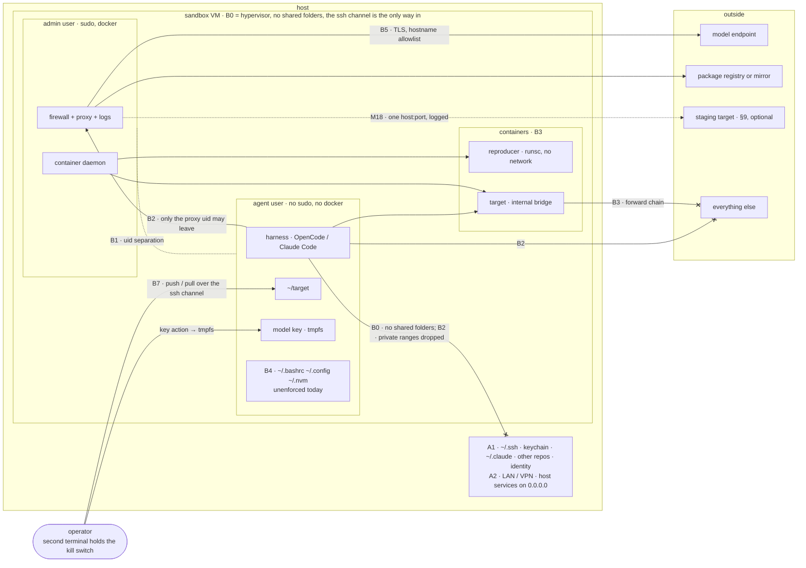

# Sandbox Threat Model

**Status:** draft v0.2, 2026-09-09. v0.1 (same day) was written *after* v0.2 of
the [reference sandbox](reference-sandbox.md), on purpose: both v0.1 → v0.2
fixes of the sandbox (the agent inheriting passwordless sudo; container traffic
bypassing the egress filter) were found by review, not by design. This document
is the design step that was skipped. v0.2 of the model reflects a walk-through
with the maintainer that fixed the design case (§1), reordered the threat
sources (§3), added the unit under test's dependencies and the target's own
side effects as sources, and admitted staging access as a sanctioned relaxation
(§9).

The catalogue is written against **boundaries**, not mechanisms: the "v0.2"
column says how the Colima/Lima implementation enforces a row today. Replacing
the base — Docker's sandbox primitives are a candidate after the PoC phase,
`to-verify` — changes that column, not the rows. Threat IDs (`T01` …) and
measure IDs (`M1` …) are meant to be cited from the guide, the scripts, and the
[hardening checklist](../hardening/hardening-checklist.md).

Facts about tools carry the repository's tags: `verified-at-source`
(documentation read on the date given), `checked` (done on a v0.2 VM),
`reported-but-unverified`, `to-verify`.

## 1. Design case and scope

**Defensive operations on your own code.** One AppSec engineer runs an AI
coding agent against a repository the organisation owns, on a laptop,
interactively, with a second terminal open for the kill switch. The agent, the
operator, and the repository all mean well. This is *not* a model for analysing
untrusted or hostile code; anyone with that need should not read the rows
below as covering it.

**The design stance.** The agent has a shell, the repository, a model API key,
and egress to the model endpoint. That endpoint is a leak channel by
construction: whatever the agent can read, it can put into a prompt. The
sandbox therefore cannot promise that data stays private; it can only promise
that **nothing but the repository under test is within reach**. Every boundary
below exists to make the set of reachable things equal to the repository plus
the key, and nothing else.

**Phases of a run** — the allowlist and the threats differ per phase:

| Phase | Who | Needs |
|---|---|---|
| provision | admin, host wrapper | open internet: apt, gVisor, nvm, Node, harness, image pulls |
| import | operator, from the host | the repository travels in over the SSH channel — **no guest egress** |
| run | agent user | the model endpoint; a package registry (the agent installs dependencies as part of its job); optionally one named staging target (§9) |
| export | operator, from the host | findings and evidence travel out over the SSH channel |
| teardown | operator, from the host | VM stopped or destroyed; key revoked; staging reset if used |

**Three kinds of agent process** appear in the tool shortlist and each loads a
different boundary:

1. **Harness agent** (OpenCode, Claude Code) as the `agent` user — the default.
2. **Containerised agent** (Strix, PentAGI) — needs the model endpoint from
   inside a container; adds a running target.
3. **Reproducer / generated code** — written by the agent from whatever it
   read; runs in `runsc` without network.

**Out of scope** (owned elsewhere or accepted): the chosen model provider
seeing the repository (tier decision) and whether its retention policy is what
you think it is (§10); a hostile operator; a compromised host; the CI variant
([`ci-runner-design.md`](../hardening/ci-runner-design.md) §2 reuses this
catalogue); availability.

## 2. Assets

| ID | Asset | Loss looks like |
|---|---|---|
| A1 | **Host filesystem, credentials, and identity** — `~/.ssh`, keychain, browser profiles, `~/.claude`, `~/.config/opencode`, every other repository, the user's name and account | read by the agent, hence in a prompt |
| A2 | **Host network position** — LAN, VPN into the organisation, SSO cookies, services bound to `0.0.0.0` on the host | the sandbox becomes a foothold or a scanner with the operator's ambient authority |
| A3 | **Model API key** | spent by someone else; misuse attributed to the organisation |
| A4 | **Code-host and registry credentials** | write access to the organisation's repositories or packages |
| A5 | **Repository under test** and, more sensitive, **unfixed-vulnerability details** | leave to anywhere but the chosen endpoint and the operator |
| A6 | **Integrity of findings** | a human or a downstream tool acts on fabricated or steered output |
| A7 | **Integrity of the sandbox** — nftables, allowlist, proxy, harness config, toolchain, rc files | containment switched off, or quietly relaxed for the *next* run |
| A8 | **Budget and human time** | runaway spend; triage volume that drowns the signal |
| A9 | **Third parties and connected systems** | offensive tooling, generated code, or the *target itself* reaches a real system |
| A10 | **Evidence** — proxy log, kernel egress-drop log, harness session log | the go/no-go decision rests on records the agent could edit |

## 3. Threat sources, in the order they matter here

| ID | Source | In this pilot |
|---|---|---|
| S5 | **Operator error** — wrong profile, bare `colima start`, key in argv or on disk, `.env` pushed with the repo, allowlist widened "for now", agent run from the admin shell, target started with real integration keys | the most likely source for a first-time audience; both "checked by doing it" incidents in the guide are S5. Consequence: **every manual step is a threat row**; controls must be wrapper actions |
| S3 | **Supply chain**, two halves. (a) *The unit under test's dependencies*: the agent legitimately runs `npm ci` / `pip install` in the target; an install script harvests the environment and phones home — the Shai-Hulud pattern (`reported-but-unverified`), not planted by anyone here, just unpinned. (b) *The sandbox's own supply chain*: harness package and install scripts, skills, images, `curl \| bash` installers, run as the admin with open internet | (a) is the second-ranked source and the one that decides key handling (M17). (b) is cheap to pin |
| — | **Committed developer configuration** — your team already uses these harnesses; a project `opencode.json` or `.claude/settings.json` written for a developer who is present is loaded by an unattended security run (T20) | intent mismatch, not attack; ranked with S5 |
| S8 | **The system under test behaving like a real system when exercised** — given a payload, your app sends the email, calls the payment API, writes to the database its config points at, fires the webhook | any dynamic testing; nothing is malicious and nothing in the agent is misconfigured |
| S2 | **Third-party content the agent reads while doing its job** — dependency source, vendored code, package READMEs, fetched pages | low probability on your own code; kept because the agent reads far more than the code you wrote |
| S6 | **Offensive tooling by design** aims at whatever it is pointed at | coverage axis only; the target address is one typo from a real system |
| S1 | **Agent autonomy without an adversary** — runaway loops, scope creep, "helpful" pushes, deletions | real (the 2026 OpenAI/HF incidents), but far down for an interactive pilot on own code |
| S7 | **Inbound from outside** | the guest is behind user-mode NAT; the host is the only inbound path (T03) |

## 4. Trust boundaries

Solid arrows are the paths that exist; crossed arrows are the paths a boundary
closes; the dotted line without arrowheads is the uid separation between the
two users; the dotted arrow is the optional staging relaxation of §9. B6, the
boundary between provisioning time and run time, is a boundary in time and
does not appear in the figure.

| Boundary | Separates | v0.2 implementation (Colima/Lima) |
|---|---|---|
| B0 | host ↔ guest | Virtualization.framework; `--mount none`; SSH channel as the only inbound path |
| B1 | admin ↔ agent inside the guest | separate uid, no sudo, no Docker socket, homes `0750` |
| B2 | guest ↔ network | nftables `output` + `forward`, policy drop, uid-keyed exception for tinyproxy; hostname allowlist |
| B3 | guest ↔ containers | Docker, `runsc --network=none`, `--internal` bridges, forward chain |
| B4 | agent process ↔ its own control plane (harness config, toolchain, rc files, repo-supplied config) | **nothing** — the agent owns its home and the repository (T20–T22) |
| B5 | agent ↔ model provider | TLS; key in tmpfs; provider-side spend cap |
| B6 | provisioning time ↔ run time | order of the bootstrap; `SKIP_EGRESS` / `REBOOTSTRAP` reopen the network |
| B7 | sandbox ↔ organisation | explicit human transfer over the SSH channel; sharing rules |

## 5. Threat catalogue

One row per threat: what happens (source → asset), what v0.2 does about it, and
the residual or gap with the measure in §8 that would close it.

### B0 — host ↔ guest

| ID | Threat | v0.2 | Residual / gap |
|---|---|---|---|
| T01 | Host directories shared into the guest; the agent reads keys, other repos, identity (S5 → A1) | Colima's default profile mounts `~` writable; `--mount none`; wrapper asserts an empty mount table on `create`/`start`/`shell`/`agent`; bootstrap refuses to run with mounts | A bare `colima start` on a missing profile creates a default VM with `~` mounted (`checked` 2026-09-08). Wrapper actions refuse; documented. Accept |
| T02 | Escape through a hypervisor or guest-kernel bug (S2 S3 → A1 A2) | the VM boundary itself | Accepted; keep the host current |
| T03 | **Guest listeners reachable from the host.** A port the agent opens, or a target published with `-p`, becomes reachable from the host's browser and local tools (S1 S8 → A1 A9) | Lima forwards guest ports to host `localhost` by default; nothing disables it | → **M4** |
| T04 | Import carries unrelated material: `.env*`, `.git/config` remotes with tokens, key files ride in with the repository (S5 → A1 A3 A4) | prose warning; manual `--exclude=.git` | → **M3** |
| T05 | Agent output lands on the host: terminal escape sequences, findings files with text aimed at whoever opens them (S2 → A1 A6) | none | → **M3**, **M8** |
| T06 | **Host identity visible in the guest.** The VM's admin account is created with the host user's name; the agent can list `/home` (S5 → A1) | Lima default (`to-verify`: `ls /home` as the agent) | → **M3** note; a neutral admin name at `create` is a one-flag change, `to-verify` |

### B1 — admin ↔ agent

| ID | Threat | v0.2 | Residual / gap |
|---|---|---|---|
| T07 | Agent switches containment off: flushes the firewall, edits the allowlist, stops the proxy (S1 → A7) | unprivileged `agent` user; bootstrap fails if it can sudo or appears in sudoers | Local privilege escalation in a guest patched only at provisioning. → **M6** |
| T08 | Container-daemon socket access, which is root-equivalent (S1 → A7) | agent not in `docker`; verification proves `docker ps` fails | None known |
| T09 | Cross-reading between users; the admin runs the agent by habit and silently drops B1 (S5 → A7) | homes `0750`; the harness is installed only in the agent's home, so `opencode` does not exist in the admin shell | Fine. Keep that property under M12 |
| T10 | Evidence tampering (S1 → A10) | proxy and kernel logs are root/`tinyproxy`-owned | The harness session log lives in the agent's home; findings are agent-written by definition. → **M7** |

### B2 — guest ↔ network

| ID | Threat | v0.2 | Residual / gap |
|---|---|---|---|
| T11 | Direct egress: exfiltration, download, callbacks (S1 S3 → A5 A3) | `output` chain, policy drop, only uid `tinyproxy` may open 443; tinyproxy `FilterDefaultDeny`, `ConnectPort 443`, connect log | Only through the proxy, only to allowlisted names |
| T12 | **Allowlisted hosts are channels.** (a) `github.com` / `*.githubusercontent.com`: the exfil path of the Shai-Hulud pattern and a payload source; not needed once import goes over the SSH channel. (b) Every model endpoint *other than the one in use*: an exfil path with a key carried in the content. (c) The package registry: needed at run time; publishing requires credentials the sandbox does not hold, so a weak channel — weaker still when it is the organisation's own mirror (S3 → A3 A5) | default allowlist ships four model endpoints, GitHub, and npm | → **M1**, **M2** |
| T13 | **DNS tunnel.** The agent may query the local stub resolver, which forwards upstream; the agent needs no DNS since the proxy resolves CONNECT hostnames (S3 → A3 A5) | `TIGHTEN_LO_DNS=1` exists, off by default, untested | → **M5** |
| T14 | Domain fronting, TLS not inspected (S2 → A5) | stated caveat | Accepted; **M10** parked |
| T15 | Reaching the host through the gateway (host services on `0.0.0.0`: dev servers, local model servers) or the LAN/VPN behind it (S1 S6 → A1 A2) | private and link-local ranges dropped and logged in `output`; policy drop covers IPv6 | Direct connections only — see T16 |
| T16 | **The proxy can reach the LAN on 443.** In the v0.2 ruleset the proxy's 443 accept precedes the private-range drop, so an allowlisted hostname that resolves to a LAN address gets through; the drop protects against the agent's direct connections, not the proxy path (S5 S2 → A2) | rule order in `bootstrap-appsec-vm.sh` §7 (read, not exercised: `to-verify`) | → **M19**; the same reorder is where the staging accept (M18) is placed explicitly |
| T17 | Inbound from the LAN (S7) | user-mode NAT | Host is the only inbound path: T03 |

### B3 — guest ↔ containers

| ID | Threat | v0.2 | Residual / gap |
|---|---|---|---|
| T18 | Container egress bypass: a default-runtime container NATs out untouched by `output` (S8 S1 → A9 A5) | `forward` chain, policy drop; verified by IP with the kernel log line | `ALLOW_CONTAINER_PROXY=1` widens to the proxy only. Fine |
| T19 | Container escape into the guest from agent-written reproducer code (S2 → A7) | `runsc`; the admin launches; the VM is the outer bound | An admin `docker run` without `--runtime=runsc` gets `runc`. → **M9** |
| T20a | **The target does something real** — sends mail, charges a card, writes to the database its config names, fires a webhook, or hangs waiting for a callback (S8 → A9 A2 A8) | the target on an `--internal` bridge; `forward` drops everything it originates and logs `egress-drop-fwd` — the rules of engagement as an enforced mechanism | Contained on the network. The residual is its **configuration**: to run, a real app needs `.env` with real integration keys, which are then within the agent's reach (T04). → **M3** default exclusion; the target runs on synthetic configuration written on purpose (guide). Callback stand-ins stay in the hardening checklist §6 |
| T20b | The deliberately vulnerable target reachable beyond the guest (S8 → A2 A9) | internal bridge; no `-p` | Via port forwarding if published: → **M4** |
| T21 | Offensive agent aims at a real system — LAN address, internet host, the host gateway (S6 → A9 A2) | `output` drops private ranges and everything not via the proxy | Without §9 this is refused by construction. With §9, exactly one address is open and logged |

### B4 — agent ↔ its own control plane

| ID | Threat | v0.2 | Residual / gap |
|---|---|---|---|
| T22 | **Committed developer configuration is loaded by the security run.** OpenCode loads a project `opencode.json` that overrides the global config *including `permission`*; an `mcp` entry of `type: local` starts its `command`; files in `.opencode/plugins/` load at startup (`verified-at-source`, opencode.ai docs *config*, *mcp-servers*, *plugins*, *permissions*, 2026-09-09). Claude Code: project `.claude/settings.json` with hooks, `.mcp.json` (`reported-but-unverified`). Written by your developers for a session where they are present; inherited by an unattended run (S5-class → A7) | none | → **M3** (strip on import), **M11** (managed config that outranks project config) |
| T23 | **Persistence across runs.** The agent owns `~/.bashrc`, `~/.config/opencode`, `~/.nvm` including the `node` binary, and npm globals; a dependency's install script (S3a) or a run plants something the next run inherits (S3 S1 → A7) | `rollback` exists, manual and optional | → **M12**, **M13** |
| T24 | Run-time installation fetches and executes code — legitimate and necessary (§1), so the question is what that code can find and where it can send it (S3a → A3 A7) | allowed via the registry on the allowlist; the key sits in the process environment | → **M1** (registry only, GitHub off), **M17** (key out of the environment) |

### B5 — agent ↔ model provider

| ID | Threat | v0.2 | Residual / gap |
|---|---|---|---|
| T25 | **Key harvested from the environment** by an install script or read by the agent; `/connect` persists it to disk; `/proc/<pid>/environ` is readable by the same uid. Leaving the VM still needs T11–T13 or T12(c) (S3a S1 → A3) | tmpfs drop `root:agent 0640`; `unkey`; guidance against `/connect`; kill switch clears the file; cap on the key | The key is the one credential inside the boundary and the one thing S3a is after. PoC: capped, per-participant, revoked at teardown. Beyond: → **M17** |
| T26 | Runaway spend or an endless loop (S1 → A8) | provider cap; abort threshold; kill switch | Nothing in the VM enforces wall-clock. → **M15** |
| T27 | Code goes to an unintended provider through a second endpoint on the allowlist (S3 S5 → A5) | none for the second endpoint | → **M2**. Routing inside the chosen provider is the tier decision |

### B6 — provisioning time ↔ run time

| ID | Threat | v0.2 | Residual / gap |
|---|---|---|---|
| T28 | Provisioning executes remote code as the admin with open internet: nvm via `curl \| bash` (tag, no checksum), `npm i -g opencode-ai@latest --allow-scripts`, `docker pull` by tag (S3b → A7) | gVisor apt repo signed; nvm pinned to a tag | → **M16** |
| T29 | Re-provisioning reopens the network on a VM whose agent home already holds state from earlier runs (S3 → A5 A7) | `create` on an existing profile re-runs the bootstrap in place | → **M13** |

### B7 — sandbox ↔ organisation

| ID | Threat | v0.2 | Residual / gap |
|---|---|---|---|
| T30 | Unfixed-vulnerability details leave the organisation (→ A5) | export is an explicit human action; the README's sharing rules | Fine |
| T31 | **Poisoned output**: findings that steer the reviewer, a "fix" with a backdoor (S2 → A6) | triage rubric; human-gated fix PR with a regression test; checklist §4 | → **M8** |
| T32 | Repository copy and findings persist on the VM disk (→ A5) | `destroy`; host disk encryption | Accepted |

## 6. Ranking

Likelihood × impact for the design case in §1:

1. **Operator error (S5)** — and every measure that adds a manual step joins
   it. M1 and M13 are only controls if the wrapper performs them.
2. **The unit under test's dependencies harvesting the key (S3a, T24 T25)** —
   ordinary unpinned dependencies, run by the agent doing its job. Bounded
   today by the allowlist; the remaining exfil path is GitHub on that list.
3. **Committed developer configuration (T22)** — silently relaxes the harness
   layer; nothing looks for it today.
4. **The target doing something real (S8, T20a)** — only when dynamic testing
   is in play, then immediately. Contained on the network; the configuration
   rule is what is missing.
5. **Persistence (T23)** — grows with VM age; the workflow does not yet make
   "throwaway" true.
6. **Provisioning supply chain (T28)**, **DNS tunnel (T13)**, **proxy-to-LAN
   rule order (T16)**, **port forwarding (T03)** — each one cheap.
7. Accepted: T02, T14, T32.

## 7. Traceability — existing measures and the threats they answer

| Measure in v0.2 | Answers |
|---|---|
| Dedicated VM, `--mount none`, mount-table assertions | T01 (T02 as the outer bound for T19) |
| Unprivileged `agent` user, no sudo, sudoers check | T07 |
| Agent not in `docker` group | T08 |
| Homes `0750`; harness installed only for the agent | T09 |
| nftables `output` chain, uid-keyed, policy drop | T11 T15 T21 |
| nftables `forward` chain, policy drop | T18 T20a T20b |
| tinyproxy hostname allowlist, `ConnectPort 443`, connect log | T11, part of T12; the log is A10 evidence |
| Private + link-local drop with log prefix | T15 (direct path only; T16 for the proxy path) |
| `TIGHTEN_LO_DNS` (optional) | T13 |
| `runsc` with `--network=none` | T19, defence in depth for T18 |
| `--internal` bridge for targets | T20a T20b T21 |
| Key in tmpfs, `key`/`unkey`, no `/connect` | T25 |
| Spend cap; abort threshold | T26 |
| Kill switch = stop **and** revoke | T25 T26 |
| `snapshot` / `rollback` / `destroy` | T23 T29 T32 (manual today) |
| Wrapper refuses bare-start and re-checks mounts | T01 (S5) |
| L4 `sandbox-runtime` (optional) | filesystem rules would partially cover T22/T23; second egress layer for T11 |

## 8. Derived measures for v0.3

Ordered by §6. Effort: S = an hour, M = a session, L = a project.

| ID | Measure | Closes | Effort | Lands in |
|---|---|---|---|---|
| **M3** | **`push` / `pull` wrapper actions.** `push` sends the repo over the SSH channel and excludes `.git` (unless asked, with remotes stripped), `.env*`, key material, and harness configuration that *executes* — `opencode.json*`, `.opencode/`, `.claude/`, `.mcp.json` — printing what it left out; instruction files (`AGENTS.md`, `CLAUDE.md`) stay. `pull` strips control characters from text exports. Removes the guest's need for GitHub | T04 T05 T20a (config) T22 (import half); enables M1 | M | wrapper, guide |
| **M1** | **Run allowlist = model endpoint + package registry; nothing switches.** GitHub off. `REGISTRY=` knob defaulting to the public registry, with the organisation's mirror preferred and documented as mandatory-friendly. Provisioning stays pre-lockdown as today | T12(a) T24 | S–M | bootstrap, guide |
| **M2** | **One model endpoint.** The bootstrap requires `MODEL_ENDPOINT` (or `ALLOWLIST`) and fails instead of shipping four | T12(b) T27 | S | bootstrap |
| **M17** | **Key-holding local proxy** (post-PoC). A small TLS-terminating proxy, root-owned config, injects the provider header; the harness gets a plain local base URL (OpenCode supports per-provider base URLs, `to-verify`). A harvested environment then contains nothing | T24 T25 | M–L | bootstrap, guide |
| **M11** | **Managed harness config, root-owned.** OpenCode's precedence puts managed config above project config (`verified-at-source`; Linux path `to-verify` via `opencode debug config`): permission floor — deny `git push`, deny edits outside `~/target`, disable project plugins/MCP if the schema allows (`to-verify`). Claude Code: managed settings (`to-verify`) | T22 (permission half) | M | bootstrap, guide |
| **M18** | **Staging target as a wrapper action** — `target add <host:port>` / `remove`: explicit accept for that address ahead of the private-range drop, log prefix `egress-target`, hostname on the proxy allowlist for 443; refuses ranges. Guide section with the compensating controls of §9 | T21 (relaxed form), T16 | M | bootstrap, wrapper, guide |
| **M19** | **Rule order:** private-range drop *before* the proxy's 443 accept; staging accepts (M18) explicitly ahead of the drop | T16 | S | bootstrap |
| **M12** | **Root-owned toolchain** under `/opt/appsec`, first on the agent's `PATH`; the home holds data only; not on the admin's `PATH` (keeps T09's property) | T23 | M | bootstrap |
| **M13** | **Rebuild is the workflow.** `run` performs `rollback` first unless told otherwise; `create` on a profile that has run an agent refuses `REBOOTSTRAP` | T23 T29 | S | wrapper, guide |
| **M4** | **Disable port forwarding** in the instance profile (`portForwards` ignore rule; Colima's exposure of it `to-verify`); host-side check that a guest listener is unreachable | T03 T20b | S | wrapper, guide |
| **M5** | **`TIGHTEN_LO_DNS=1` by default**, with a verification step | T13 | S | bootstrap |
| **M14** | **Skills and plugins at provisioning**, pinned to a commit, chosen by the operator | T24 (harness half) | S | bootstrap, guide |
| **M16** | **Pin the provisioning supply chain**: nvm installer by SHA-256, `opencode-ai@<version>`, images by digest, `/etc/appsec/manifest` | T28 | S–M | bootstrap |
| **M9** | **`default-runtime: runsc`**; the verification names `--runtime=runc` explicitly (`to-verify` through Colima's `docker:` key) | T19 | S | wrapper, bootstrap |
| **M6** | **Guest patch level**: `apt-get upgrade` in the bootstrap; stated maximum VM age | T07 residual | S | bootstrap, guide |
| **M7** | **`evidence` wrapper action**: proxy log, kernel drop lines, harness session directory into a dated host tarball; session log labelled agent-writable | T10 | M | wrapper |
| **M8** | **Export hygiene**: findings labelled agent-generated; never an input to a second agent without the human step; open in an editor, not a terminal | T31 T05 | S | guide |
| **M15** | **Wall-clock budget** around non-interactive runs | T26 | S | guide |
| M10 | TLS-inspecting proxy | T14 | L | parked |

Suggested v0.3 cut: **M3, M1, M2, M19, M13, M5, M4** — one change to the
documented workflow (push, run, pull) and the allowlist. M18 follows as soon
as a participant needs staging. M11, M12, M14, M16, M9, M6 are bootstrap-only.
M7, M8, M15 are documentation and one wrapper action. M17 is the first
post-PoC item.

## 9. Sanctioned relaxation: a staging target

Dynamic testing against an environment the participant already runs is a valid
need. The reference sandbox refuses it by construction (T21); this section says
how to allow it without editing firewall rules by hand.

**What it spends.** The guest reaches the LAN through the *host's* network
position, VPN included. Opening staging deliberately spends the ambient
authority the sandbox otherwise protects (A2), on one address. The relaxation
therefore converts ambient authority into explicit authority.

| Control | Form |
|---|---|
| One named target | host and port, never a range; added and removed with a wrapper action (M18) |
| Explicit credentials | staging-only, short-lived, scoped to that environment; issued for the run, revoked at teardown — the ambient VPN reach is not the credential |
| Every connection logged | firewall log prefix `egress-target` and, for HTTPS, the proxy log; retained with the run's evidence |
| A resettable target | snapshot or redeploy exists and has been exercised; the target holds no real integrations (synthetic configuration, T20a) and no production data |
| An owner and a window | the environment's owner agreed to the time window and knows what will hit it; monitoring on-call is told, so the alerts that fire are expected ones |
| Tooling posture | shorter runs, no spraying scan modes, rate limits in the tool's config — the checklist §6 rows |
| Kill switch, three halves | stop the VM, revoke the key **and the staging credentials**, reset the target — stopping does not undo what already happened |

Not covered by the relaxation, and stated so: a target that shares a backend
with production; a target reached through a jump host or a second network the
sandbox would also have to see.

## 10. Accepted risks

- **T02** hypervisor / guest-kernel escape — patching only.
- **T14** domain fronting and TLS opacity — the allowlist is a coarse filter;
  the volume and behaviour of *allowed* traffic is what the proxy log is for.
- **T32** data at rest inside the VM — host disk encryption and `destroy`.
- **The chosen provider sees the repository**, and **whether its retention
  policy (ZDR on OpenRouter, for instance) is configured as you believe** — a
  tier decision made before the sandbox is involved. The sandbox cannot
  verify a provider-side setting; the reference guide's self-certification
  checklist carries a line for it.
- **Hostile or untrusted code as the unit under test** — outside the design
  case (§1).
- **Model refusals and outages** — an availability problem for the pilot.

## 11. When to revisit

- The harness or its version changes (T22/T23 details: config paths, plugin
  loading, managed-config semantics).
- The base changes (Docker sandbox primitives, another hypervisor): re-fill
  the v0.2 column of every table; the rows should stand.
- A containerised agent or a running target enters the pilot (B3 rows,
  `ALLOW_CONTAINER_PROXY`, §9).
- Any allowlist change — each new hostname is a new T12 row until argued
  otherwise.
- A published incident in this class: add the row, name the incident, as the
  hardening checklist does.
